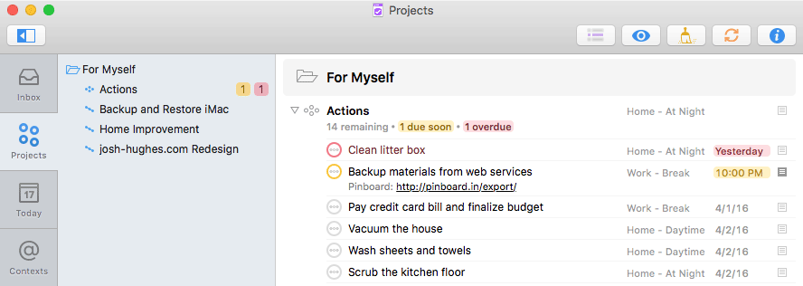

# San Francisco Light Theme

[OmniFocus 2.5](https://www.omnigroup.com/omnifocus/) adds a Style Preference Pane, so I developed a theme that makes fairly minor tweaks to the built-in System Font collection and OmniFocus Light color palette.

The changes consist of:

- Lots of font size and spacing adjustments.
- Overdue tasks appear in red.
- Links appear in black.
- In the custom columns layout, placeholder text is hidden unless you hover over the column.

## [Download Theme](https://github.com/deaghean/omnifocus-themes/archive/master.zip)

Feedback and suggestions are welcome. I can be reached at [josh@josh-hughes.com](mailto:josh@josh-hughes.com).