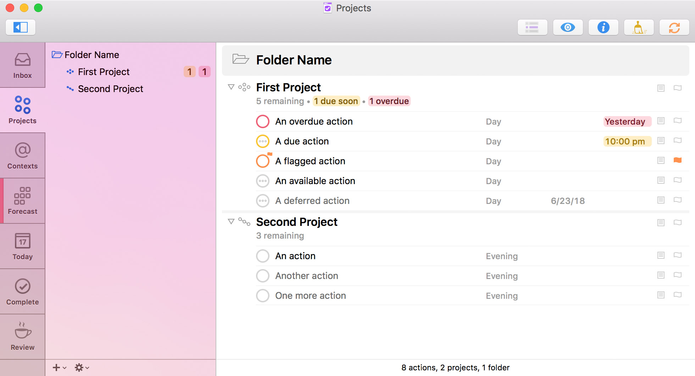
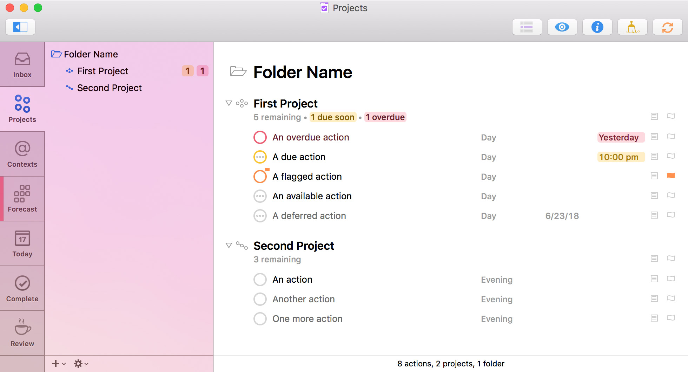

# [San Francisco Light Theme](https://raw.githubusercontent.com/deaghean/omnifocus-themes/master/San%20Francisco%20Light.ofocus-style)

[OmniFocus 2.5+ for Mac](https://www.omnigroup.com/omnifocus/) adds a Style Preference Pane, so I developed a theme that makes fairly minor tweaks to the built-in System Font collection and OmniFocus Light color palette.

The changes consist of:

- Lots of font size and spacing adjustments.
- Overdue tasks appear in red.
- Links appear in black.
- In the custom columns layout, placeholder text is hidden unless you hover over the column.

[Download Theme](https://raw.githubusercontent.com/deaghean/omnifocus-themes/master/San%20Francisco%20Light.ofocus-style)

# [San Francisco Light Theme, No Grid](https://raw.githubusercontent.com/deaghean/omnifocus-themes/master/San%20Francisco%20Light%20-%20No%20Grid.ofocus-style)

This theme is a variation of San Francisco Light that removes grid lines, and adds space between projects and folders.

The changes consist of:

- Lots of font size and spacing adjustments.
- Overdue tasks appear in red.
- Links appear in black.
- In the custom columns layout, placeholder text is hidden unless you hover over the column.

[Download Theme](https://raw.githubusercontent.com/deaghean/omnifocus-themes/master/San%20Francisco%20Light%20-%20No%20Grid.ofocus-style)

# [Dark Sidebar, Experimental](https://raw.githubusercontent.com/deaghean/omnifocus-themes/master/Dark%20Sidebar.ofocus-style)

Not really ready for primetime. Exists mostly as a case study for certain layout issues in OmniFocus.

[Download Theme](https://raw.githubusercontent.com/deaghean/omnifocus-themes/master/Dark%20Sidebar.ofocus-style)

Feedback and suggestions are welcome. I can be reached at [josh@josh-hughes.com](mailto:josh@josh-hughes.com).